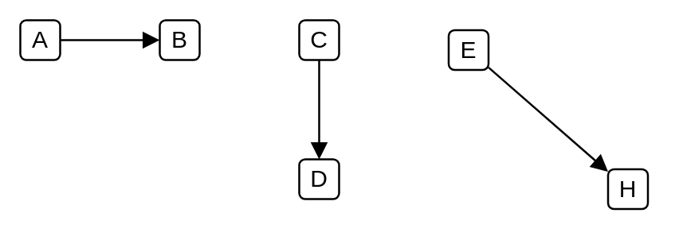

# Message

## Definition

```
{
  _style: { 
    dependency: 'html=1;verticalAlign=bottom;endArrow=block;curved=0;rounded=0;',
  },
}
```

## Usage

```
import { Message } from '@dinghy/standard-components-diagrams/uml'

<Message/>
```

## Preview


