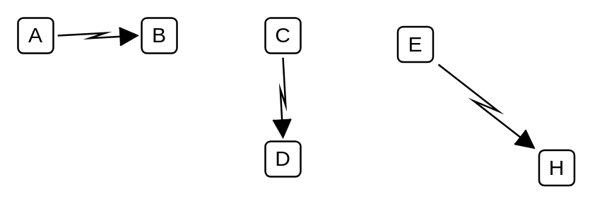

# Activity

## Definition

```
{
  _style: { 
    dependency: 'shape=mxgraph.lean_mapping.electronic_info_flow_edge;html=1;',
  },
}
```

## Usage

```
import { Activity } from '@dinghy/standard-components-diagrams/uml25'

<Activity/>
```

## Preview


