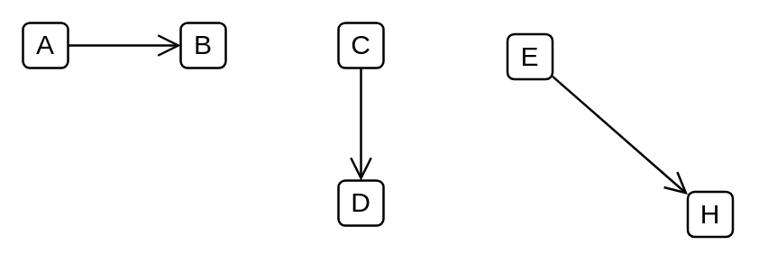

# Association / Connector / Instance Specification / Property / Connector End / Navigability notation

## Definition

```
{
  _style: { 
    dependency: 'endArrow=open;startArrow=none;endFill=0;startFill=0;endSize=8;html=1;verticalAlign=bottom;labelBackgroundColor=none;strokeWidth=1;',
  },
}
```

## Usage

```
import { AssociationConnectorInstanceSpecificationPropertyConnectorEndNavigabilityNotation } from '@diac/standard-components-diagrams/uml25'

<AssociationConnectorInstanceSpecificationPropertyConnectorEndNavigabilityNotation/>
```

## Preview


