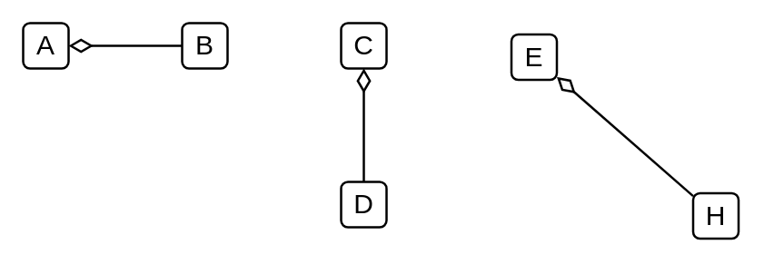

# Association / Connector / Instance Specification / Property / Connector End / Shared Association

## Definition

```
{
  _style: { 
    dependency: 'endArrow=none;startArrow=diamondThin;endFill=0;startFill=0;html=1;verticalAlign=bottom;labelBackgroundColor=none;strokeWidth=1;startSize=8;endSize=8;',
  },
}
```

## Usage

```
import { AssociationConnectorInstanceSpecificationPropertyConnectorEndSharedAssociation } from '@reactiac/standard-components-diagrams/uml25'

<AssociationConnectorInstanceSpecificationPropertyConnectorEndSharedAssociation/>
```

## Preview


