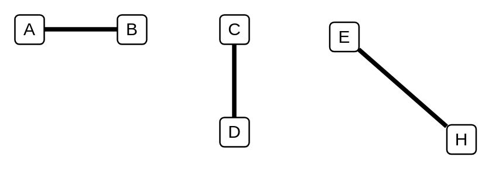

# Association / Connector / Instance Specification / Property / Connector End

## Definition

```
{
  _style: { 
    dependency: 'endArrow=none;startArrow=none;endFill=0;startFill=0;endSize=8;html=1;verticalAlign=bottom;labelBackgroundColor=none;strokeWidth=3;',
  },
}
```

## Usage

```
import { AssociationConnectorInstanceSpecificationPropertyConnectorEnd } from '@dinghy/standard-components-diagrams/uml25'

<AssociationConnectorInstanceSpecificationPropertyConnectorEnd/>
```

## Preview


