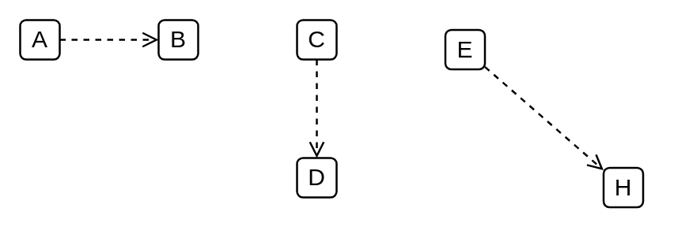

# Collaboration Use

## Definition

```
{
  _style: { 
    dependency: 'html=1;verticalAlign=bottom;labelBackgroundColor=none;endArrow=open;endFill=0;dashed=1;',
  },
}
```

## Usage

```
import { CollaborationUse } from '@reactiac/standard-components-diagrams/uml25'

<CollaborationUse/>
```

## Preview


