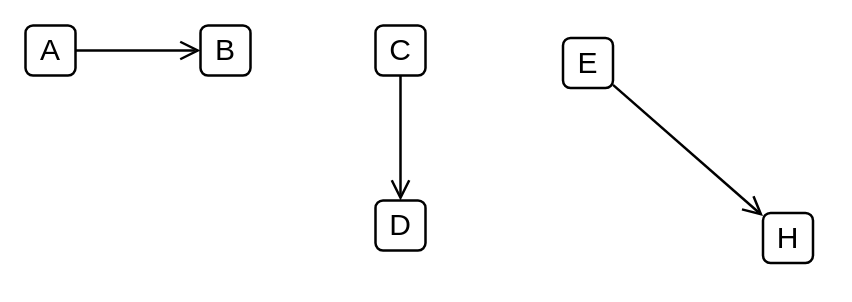

# Control Flow

## Definition

```
{
  _style: { 
    dependency: 'html=1;verticalAlign=top;labelBackgroundColor=none;endArrow=open;endFill=0;',
  },
}
```

## Usage

```
import { ControlFlow } from '@diac/standard-components-diagrams/uml25'

<ControlFlow/>
```

## Preview


