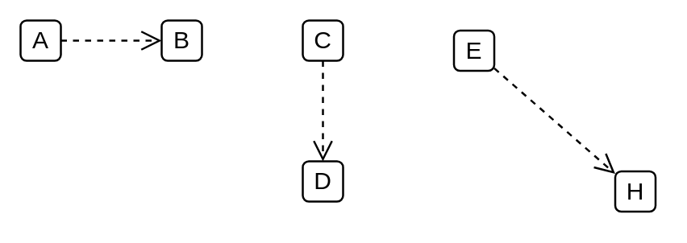

# Element / Package Merge / Package Import, Substitution

## Definition

```
{
  _style: { 
    dependency: 'endArrow=open;startArrow=none;endFill=0;startFill=0;endSize=8;html=1;verticalAlign=bottom;dashed=1;labelBackgroundColor=none;',
  },
}
```

## Usage

```
import { ElementPackageMergePackageImportSubstitution } from '@reactiac/standard-components-diagrams/uml25'

<ElementPackageMergePackageImportSubstitution/>
```

## Preview


