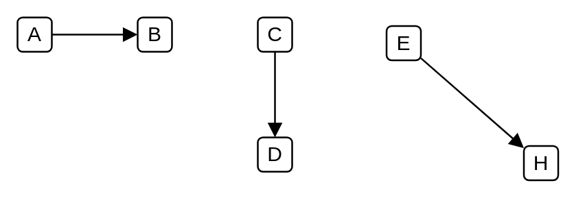

# Message, synchronous call

## Definition

```
{
  _style: { 
    dependency: 'html=1;verticalAlign=bottom;labelBackgroundColor=none;endArrow=block;endFill=1;',
  },
}
```

## Usage

```
import { MessageSynchronousCall } from '@reactiac/standard-components-diagrams/uml25'

<MessageSynchronousCall/>
```

## Preview


