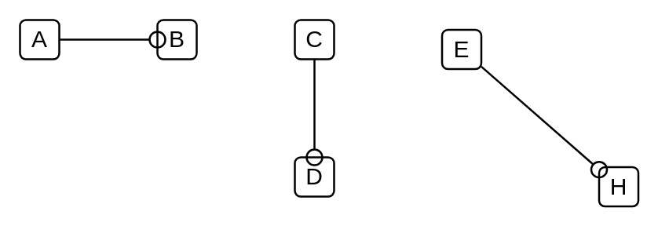

# Provided Interface

## Definition

```
{
  _style: { 
    dependency: 'html=1;verticalAlign=bottom;labelBackgroundColor=none;endArrow=oval;endFill=0;endSize=8;',
  },
}
```

## Usage

```
import { ProvidedInterface } from '@dinghy/standard-components-diagrams/uml25'

<ProvidedInterface/>
```

## Preview


