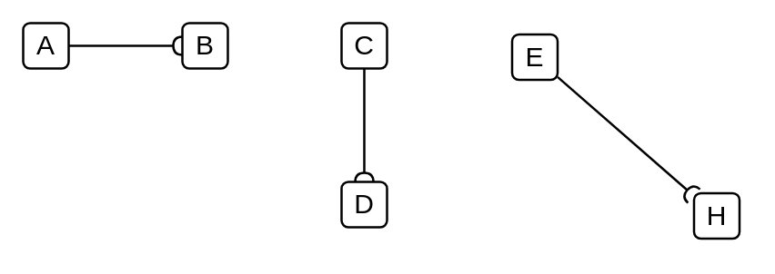

# Required Interface

## Definition

```
{
  _style: { 
    dependency: 'html=1;verticalAlign=bottom;labelBackgroundColor=none;endArrow=halfCircle;endFill=0;endSize=2;',
  },
}
```

## Usage

```
import { RequiredInterface } from '@diac/standard-components-diagrams/uml25'

<RequiredInterface/>
```

## Preview


