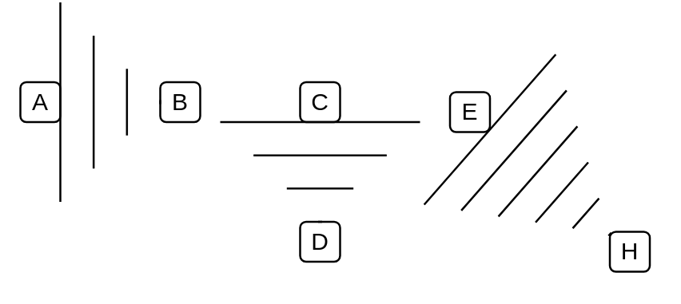

# Wedge Arrow Dashed

## Definition

```
{
  _style: { 
    dependency: 'shape=mxgraph.arrows2.wedgeArrowDashed2;html=1;bendable=0;startWidth=50;stepSize=15;',
  },
}
```

## Usage

```
import { WedgeArrowDashed } from '@dinghy/standard-components-diagrams/arrows2'

<WedgeArrowDashed/>
```

## Preview


