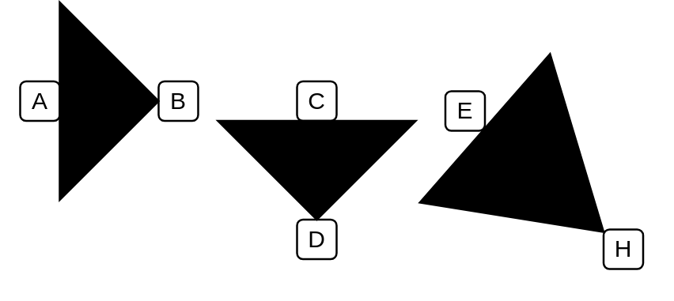

# Wedge Arrow

## Definition

```
{
  _style: { 
    dependency: 'shape=mxgraph.arrows2.wedgeArrow;html=1;bendable=0;startWidth=50;fillColor=strokeColor;defaultFillColor=invert;defaultGradientColor=invert;',
  },
}
```

## Usage

```
import { WedgeArrow } from '@diac/standard-components-diagrams/arrows2'

<WedgeArrow/>
```

## Preview


