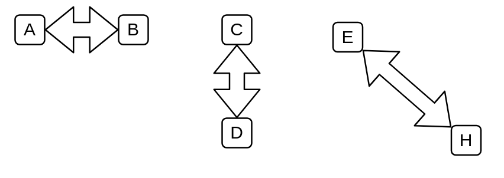

# Bidirectional Arrow

## Definition

```
{
  _style: { 
    dependency: 'shape=flexArrow;endArrow=classic;startArrow=classic;html=1;',
  },
}
```

## Usage

```
import { BidirectionalArrow } from '@dinghy/standard-components-diagrams/general'

<BidirectionalArrow/>
```

## Preview


