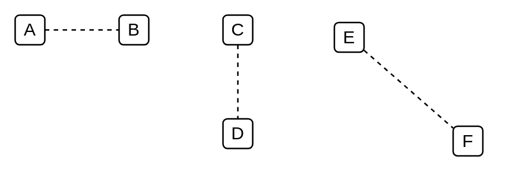

# Dashed Line

## Definition

```
{
  _style: { 
    dependency: 'endArrow=none;dashed=1;html=1;',
  },
}
```

## Usage

```
import { DashedLine } from '@diac/standard-components-diagrams/general'

<DashedLine/>
```

## Preview


