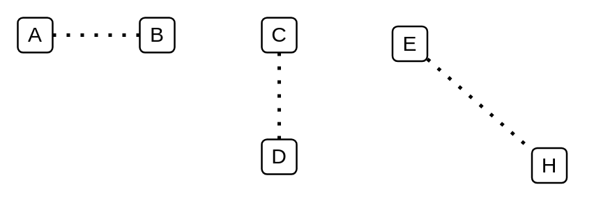

# Dotted Line

## Definition

```
{
  _style: { 
    dependency: 'endArrow=none;dashed=1;html=1;dashPattern=1 3;strokeWidth=2;',
  },
}
```

## Usage

```
import { DottedLine } from '@reactiac/standard-components-diagrams/general'

<DottedLine/>
```

## Preview


