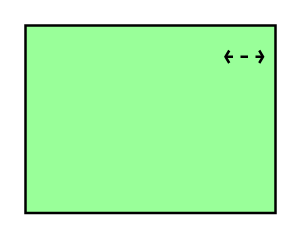

# Communications Path

## Definition

```
{
  _style: { 
    entity: 'html=1;outlineConnect=0;whiteSpace=wrap;fillColor=#99ff99;shape=mxgraph.archimate.application;appType=commPath',
  },
  _original_width: 100,
  _original_height: 75,
}
```

## Usage

```
import { CommunicationsPath } from '@diac/standard-components-diagrams/archimate2'

<CommunicationsPath/>
```

## Preview


