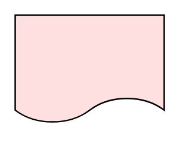

# Deliverable

## Definition

```
{
  _style: 'html=1;outlineConnect=0;whiteSpace=wrap;fillColor=#ffe0e0;shape=mxgraph.archimate.representation',
  _width: 100,
  _height: 75,
}
```

## Usage

```
import { Deliverable } from '@diac/standard-components-diagrams/archimate2'

<Deliverable/>
```

## Preview


