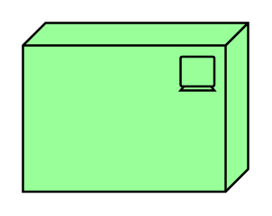

# Device

## Definition

```
{
  _style: { 
    entity: 'html=1;outlineConnect=0;whiteSpace=wrap;fillColor=#99ff99;shape=mxgraph.archimate.tech;techType=device',
  },
  _width: 100,
  _height: 75,
}
```

## Usage

```
import { Device } from '@diac/standard-components-diagrams/archimate2'

<Device/>
```

## Preview


