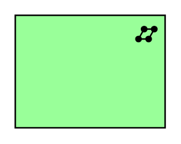

# Network

## Definition

```
{
  _style: 'html=1;outlineConnect=0;whiteSpace=wrap;fillColor=#99ff99;shape=mxgraph.archimate.application;appType=network',
  _width: 100,
  _height: 75,
}
```

## Usage

```
import { Network } from '@reactiac/standard-components-diagrams/archimate2'

<Network/>
```

## Preview


