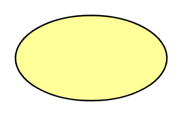

# Value

## Definition

```
{
  _style: 'fillColor=#ffff99;whiteSpace=wrap;shape=ellipse;html=1;',
  _width: 100,
  _height: 56.25,
}
```

## Usage

```
import { Value } from '@diac/standard-components-diagrams/archimate2'

<Value/>
```

## Preview


