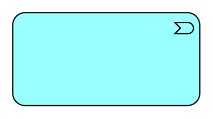

# Application Event

## Definition

```
{
  _style: { 
    entity: 'html=1;outlineConnect=0;whiteSpace=wrap;fillColor=#99ffff;shape=mxgraph.archimate3.application;appType=event;archiType=rounded',
  },
  _width: 150,
  _height: 75,
}
```

## Usage

```
import { ApplicationEvent } from '@diac/standard-components-diagrams/archimate3Application'

<ApplicationEvent/>
```

## Preview


