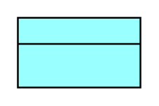

# Data Object 2

## Definition

```
{
  _style: 'html=1;outlineConnect=0;whiteSpace=wrap;fillColor=#99ffff;shape=mxgraph.archimate3.businessObject;overflow=fill;',
  _width: 70,
  _height: 40,
}
```

## Usage

```
import { DataObject2 } from '@diac/standard-components-diagrams/archimate3Application'

<DataObject2/>
```

## Preview


