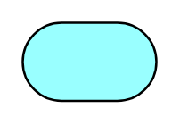

# Service

## Definition

```
{
  _style: 'html=1;outlineConnect=0;whiteSpace=wrap;fillColor=#99ffff;shape=mxgraph.archimate3.service;',
  _width: 60,
  _height: 35,
}
```

## Usage

```
import { Service } from '@reactiac/standard-components-diagrams/archimate3Application'

<Service/>
```

## Preview


