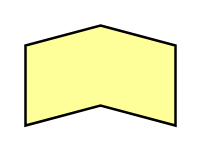

# Business Function 2

## Definition

```
{
  _style: { 
    entity: 'html=1;outlineConnect=0;whiteSpace=wrap;fillColor=#ffff99;shape=mxgraph.archimate3.function;',
  },
  _original_width: 60,
  _original_height: 40,
}
```

## Usage

```
import { BusinessFunction2 } from '@diac/standard-components-diagrams/archimate3Business'

<BusinessFunction2/>
```

## Preview


