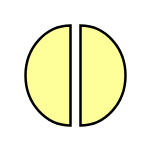

# Business Interaction 2

## Definition

```
{
  _style: 'html=1;outlineConnect=0;whiteSpace=wrap;fillColor=#ffff99;shape=mxgraph.archimate3.interaction;',
  _width: 40,
  _height: 40,
}
```

## Usage

```
import { BusinessInteraction2 } from '@reactiac/standard-components-diagrams/archimate3Business'

<BusinessInteraction2/>
```

## Preview


