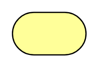

# Business Service 2

## Definition

```
{
  _style: { 
    entity: 'html=1;outlineConnect=0;whiteSpace=wrap;fillColor=#ffff99;shape=mxgraph.archimate3.service;',
  },
  _width: 60,
  _height: 35,
}
```

## Usage

```
import { BusinessService2 } from '@diac/standard-components-diagrams/archimate3Business'

<BusinessService2/>
```

## Preview


