# Archimate3 Business Entities

- [Actor](./actor.md)  
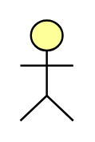

- [BusinessActor](./business-actor.md)  

- [BusinessCollaboration](./business-collaboration.md)  
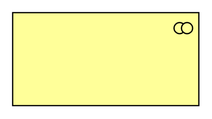

- [BusinessEvent](./business-event.md)  
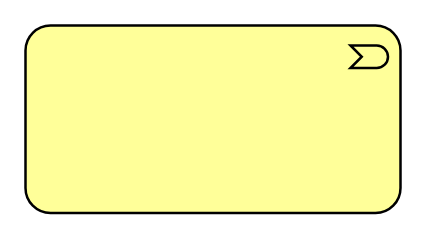

- [BusinessEvent2](./business-event-2.md)  
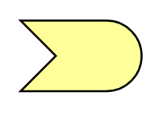

- [BusinessFunction](./business-function.md)  
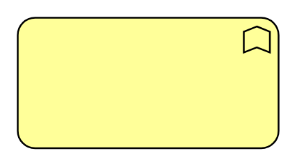

- [BusinessFunction2](./business-function-2.md)  

- [BusinessInteraction](./business-interaction.md)  
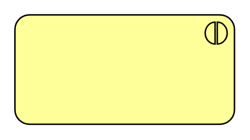

- [BusinessInteraction2](./business-interaction-2.md)  

- [BusinessInterface](./business-interface.md)  
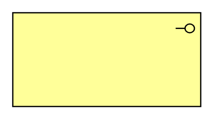

- [BusinessInterface2](./business-interface-2.md)  

- [BusinessObject](./business-object.md)  

- [BusinessObject2](./business-object-2.md)  
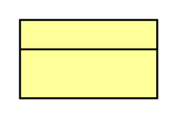

- [BusinessProcess](./business-process.md)  
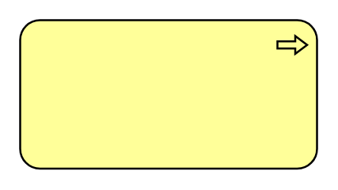

- [BusinessProcess2](./business-process-2.md)  
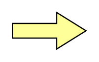

- [BusinessRole](./business-role.md)  

- [BusinessRole2](./business-role-2.md)  
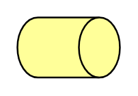

- [BusinessService](./business-service.md)  
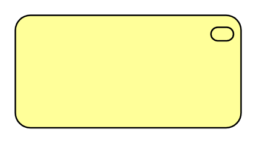

- [BusinessService2](./business-service-2.md)  

- [Collaboration](./collaboration.md)  
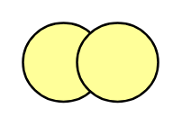

- [Contract](./contract.md)  
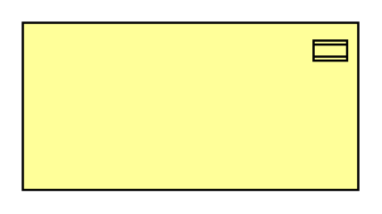

- [Contract2](./contract-2.md)  

- [Product](./product.md)  

- [Product2](./product-2.md)  

- [Representation](./representation.md)  
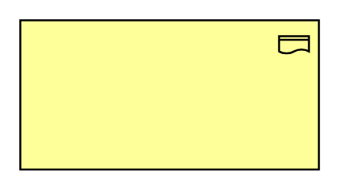

- [Representation2](./representation-2.md)  

