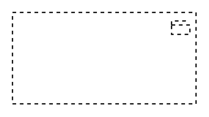

# Grouping

## Definition

```
{
  _style: 'html=1;outlineConnect=0;whiteSpace=wrap;shape=mxgraph.archimate3.application;appType=grouping;archiType=square;dashed=1;fillColor=none;',
  _width: 150,
  _height: 75,
}
```

## Usage

```
import { Grouping } from '@diac/standard-components-diagrams/archimate3Generic'

<Grouping/>
```

## Preview


