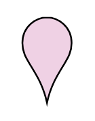

# Location 2

## Definition

```
{
  _style: 'html=1;outlineConnect=0;whiteSpace=wrap;shape=mxgraph.archimate3.locationIcon;fillColor=#efd1e4;aspect=fixed;',
  _width: 35,
  _height: 50,
}
```

## Usage

```
import { Location2 } from '@diac/standard-components-diagrams/archimate3Generic'

<Location2/>
```

## Preview


