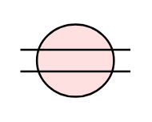

# Gap 2

## Definition

```
{
  _style: { 
    entity: 'html=1;outlineConnect=0;whiteSpace=wrap;fillColor=#FFE0E0;shape=mxgraph.archimate3.gapIcon;',
  },
  _width: 55,
  _height: 40,
}
```

## Usage

```
import { Gap2 } from '@diac/standard-components-diagrams/archimate3ImplementationAndMigration'

<Gap2/>
```

## Preview


