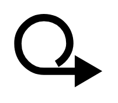

# Work Package 2

## Definition

```
{
  _style: 'html=1;outlineConnect=0;whiteSpace=wrap;fillColor=#FFE0E0;shape=mxgraph.archimate3.workPackage;strokeWidth=5;',
  _width: 60,
  _height: 50,
}
```

## Usage

```
import { WorkPackage2 } from '@reactiac/standard-components-diagrams/archimate3ImplementationAndMigration'

<WorkPackage2/>
```

## Preview


