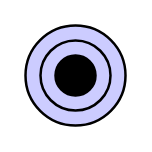

# Goal 2

## Definition

```
{
  _style: { 
    entity: 'html=1;outlineConnect=0;whiteSpace=wrap;fillColor=#CCCCFF;shape=mxgraph.archimate3.goal;',
  },
  _original_width: 40,
  _original_height: 40,
}
```

## Usage

```
import { Goal2 } from '@diac/standard-components-diagrams/archimate3Motivation'

<Goal2/>
```

## Preview


