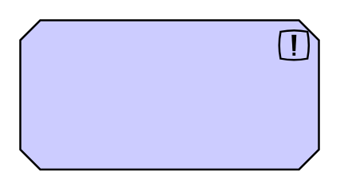

# Principle

## Definition

```
{
  _style: 'html=1;outlineConnect=0;whiteSpace=wrap;fillColor=#CCCCFF;shape=mxgraph.archimate3.application;appType=principle;archiType=oct;',
  _width: 150,
  _height: 75,
}
```

## Usage

```
import { Principle } from '@diac/standard-components-diagrams/archimate3Motivation'

<Principle/>
```

## Preview


