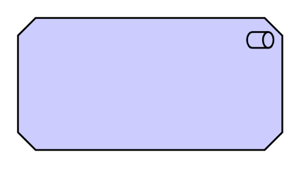

# Stakeholder

## Definition

```
{
  _style: 'html=1;outlineConnect=0;whiteSpace=wrap;fillColor=#CCCCFF;shape=mxgraph.archimate3.application;appType=role;archiType=oct;',
  _width: 150,
  _height: 75,
}
```

## Usage

```
import { Stakeholder } from '@reactiac/standard-components-diagrams/archimate3Motivation'

<Stakeholder/>
```

## Preview


