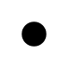

# And Junction

## Definition

```
{
  _style: 'ellipse;html=1;verticalLabelPosition=bottom;labelBackgroundColor=#ffffff;verticalAlign=top;fillColor=strokeColor',
  _width: 10,
  _height: 10,
}
```

## Usage

```
import { AndJunction } from '@reactiac/standard-components-diagrams/archimate3Relationships'

<AndJunction/>
```

## Preview


