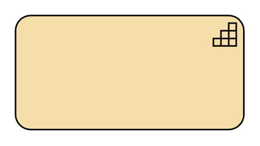
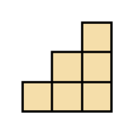
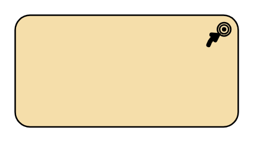
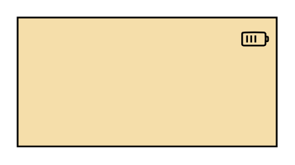
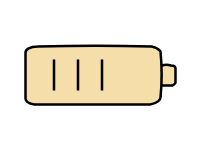
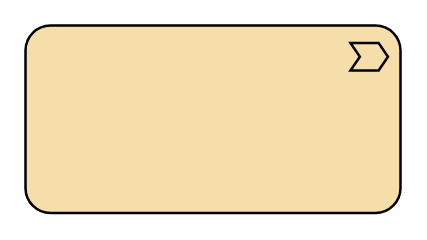
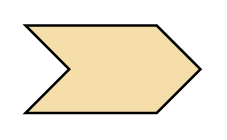

# Archimate3 Strategy Entities

- [Capability](./capability.md)  

- [Capability2](./capability-2.md)  

- [CourseOfAction](./course-of-action.md)  

- [CourseOfAction2](./course-of-action-2.md)  

- [Resource](./resource.md)  

- [Resource2](./resource-2.md)  

- [ValueStream](./value-stream.md)  

- [ValueStream2](./value-stream-2.md)  

