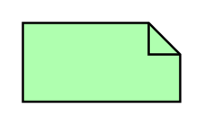

# Artifact 2

## Definition

```
{
  _style: 'html=1;outlineConnect=0;whiteSpace=wrap;fillColor=#AFFFAF;shape=note;size=14;',
  _width: 70,
  _height: 35,
}
```

## Usage

```
import { Artifact2 } from '@diac/standard-components-diagrams/archimate3Technology'

<Artifact2/>
```

## Preview


