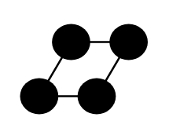

# Communication Network 2

## Definition

```
{
  _style: { 
    entity: 'html=1;outlineConnect=0;whiteSpace=wrap;fillColor=#AFFFAF;shape=mxgraph.archimate3.network;',
  },
  _width: 65,
  _height: 50,
}
```

## Usage

```
import { CommunicationNetwork2 } from '@diac/standard-components-diagrams/archimate3Technology'

<CommunicationNetwork2/>
```

## Preview


