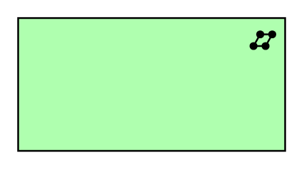

# Communication Network

## Definition

```
{
  _style: { 
    entity: 'html=1;outlineConnect=0;whiteSpace=wrap;fillColor=#AFFFAF;shape=mxgraph.archimate3.application;appType=netw;archiType=square;',
  },
  _original_width: 150,
  _original_height: 75,
}
```

## Usage

```
import { CommunicationNetwork } from '@diac/standard-components-diagrams/archimate3Technology'

<CommunicationNetwork/>
```

## Preview


