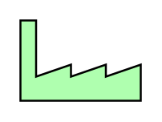

# Facility 2

## Definition

```
{
  _style: 'html=1;outlineConnect=0;whiteSpace=wrap;fillColor=#AFFFAF;shape=mxgraph.archimate3.facility;',
  _width: 60,
  _height: 40,
}
```

## Usage

```
import { Facility2 } from '@reactiac/standard-components-diagrams/archimate3Technology'

<Facility2/>
```

## Preview


