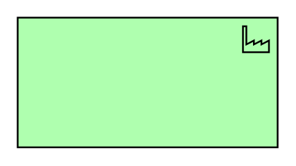
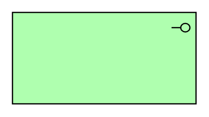

# Archimate3 Technology Entities

- [Artifact](./artifact.md)  

- [Artifact2](./artifact-2.md)  

- [Collaboration](./collaboration.md)  

- [CommunicationNetwork](./communication-network.md)  

- [CommunicationNetwork2](./communication-network-2.md)  

- [Device](./device.md)  

- [Device2](./device-2.md)  

- [DistributionNetwork](./distribution-network.md)  

- [DistributionNetwork2](./distribution-network-2.md)  

- [Equipment](./equipment.md)  

- [Equipment2](./equipment-2.md)  

- [Event](./event.md)  

- [Facility](./facility.md)  

- [Facility2](./facility-2.md)  

- [Function](./function.md)  

- [Interaction](./interaction.md)  

- [Interface](./interface.md)  

- [Material](./material.md)  

- [Material2](./material-2.md)  

- [Node](./node.md)  

- [Node2](./node-2.md)  

- [Path](./path.md)  

- [Path2](./path-2.md)  

- [Process](./process.md)  

- [Service](./service.md)  

- [SystemSoftware](./system-software.md)  

- [SystemSoftware2](./system-software-2.md)  

- [TechnologyCollaboration](./technology-collaboration.md)  

- [TechnologyEvent](./technology-event.md)  

- [TechnologyFunction](./technology-function.md)  

- [TechnologyInteraction](./technology-interaction.md)  

- [TechnologyInterface](./technology-interface.md)  

- [TechnologyProcess](./technology-process.md)  

- [TechnologyService](./technology-service.md)  

