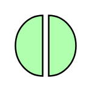

# Interaction

## Definition

```
{
  _style: 'html=1;outlineConnect=0;whiteSpace=wrap;fillColor=#AFFFAF;shape=mxgraph.archimate3.interaction;',
  _width: 40,
  _height: 40,
}
```

## Usage

```
import { Interaction } from '@diac/standard-components-diagrams/archimate3Technology'

<Interaction/>
```

## Preview


