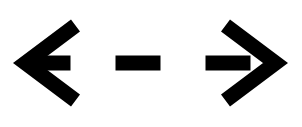

# Path 2

## Definition

```
{
  _style: 'html=1;outlineConnect=0;whiteSpace=wrap;fillColor=#AFFFAF;shape=mxgraph.archimate3.path;strokeWidth=6;',
  _width: 100,
  _height: 30,
}
```

## Usage

```
import { Path2 } from '@reactiac/standard-components-diagrams/archimate3Technology'

<Path2/>
```

## Preview


