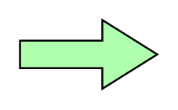

# Process

## Definition

```
{
  _style: 'html=1;outlineConnect=0;whiteSpace=wrap;fillColor=#AFFFAF;shape=mxgraph.archimate3.process;',
  _width: 70,
  _height: 35,
}
```

## Usage

```
import { Process } from '@reactiac/standard-components-diagrams/archimate3Technology'

<Process/>
```

## Preview


