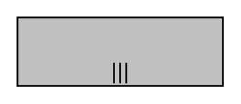

# Additional Participant, Non-Initiating, Multi-Instance, Bottom

## Definition

```
{
  _style: { 
    entity: 'shape=mxgraph.bpmn.task2;part=1;taskMarker=abstract;rectStyle=square;verticalAlign=top;isLoopMultiParallel=1;fillColor=#C0C0C0;whiteSpace=wrap;html=1;',
  },
  _original_width: 120,
  _original_height: 40,
}
```

## Usage

```
import { AdditionalParticipantNonInitiatingMultiInstanceBottom } from '@diac/standard-components-diagrams/bpmn2Choreographies'

<AdditionalParticipantNonInitiatingMultiInstanceBottom/>
```

## Preview


