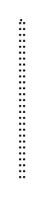
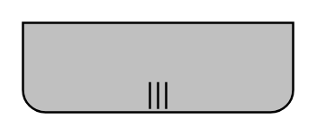

# BPMN 2.0 Choreographies Entities

- [AdditionalParticipantInitiating](./additional-participant-initiating.md)  

- [AdditionalParticipantInitiatingMultiInstanceBottom](./additional-participant-initiating-multi-instance-bottom.md)  

- [AdditionalParticipantNonInitiating](./additional-participant-non-initiating.md)  

- [AdditionalParticipantNonInitiatingMultiInstanceBottom](./additional-participant-non-initiating-multi-instance-bottom.md)  

- [ParticipantInitiatingBottom](./participant-initiating-bottom.md)  

- [ParticipantInitiatingBottomWithDecorator](./participant-initiating-bottom-with-decorator.md)  

- [ParticipantInitiatingMultiInstanceBottom](./participant-initiating-multi-instance-bottom.md)  

- [ParticipantInitiatingMultiInstanceBottomWithDecorator](./participant-initiating-multi-instance-bottom-with-decorator.md)  

- [ParticipantInitiatingMultiInstanceTop](./participant-initiating-multi-instance-top.md)  

- [ParticipantInitiatingTop](./participant-initiating-top.md)  

- [ParticipantInitiatingTopWithDecorator](./participant-initiating-top-with-decorator.md)  

- [ParticipantInitiatingTopWithDecorator2](./participant-initiating-top-with-decorator-2.md)  

- [ParticipantInitiatingTopWithDecorator3](./participant-initiating-top-with-decorator-3.md)  

- [ParticipantNonInitiatingBottom](./participant-non-initiating-bottom.md)  

- [ParticipantNonInitiatingMultiInstanceBottom](./participant-non-initiating-multi-instance-bottom.md)  

- [ParticipantNonInitiatingMultiInstanceBottomWithDecorator](./participant-non-initiating-multi-instance-bottom-with-decorator.md)  

- [ParticipantNonInitiatingMultiInstanceTop](./participant-non-initiating-multi-instance-top.md)  

- [ParticipantNonInitiatingTop](./participant-non-initiating-top.md)  

- [ParticipantNonInitiatingTopWithDecorator](./participant-non-initiating-top-with-decorator.md)  

