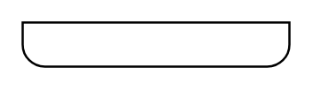

# Participant, Initiating, Bottom

## Definition

```
{
  _style: { 
    entity: 'shape=mxgraph.bpmn.task2;part=1;taskMarker=abstract;rectStyle=rounded;isLoopSub=0;topLeftStyle=square;topRightStyle=square;whiteSpace=wrap;html=1;',
  },
  _original_width: 120,
  _original_height: 20,
}
```

## Usage

```
import { ParticipantInitiatingBottom } from '@diac/standard-components-diagrams/bpmn2Choreographies'

<ParticipantInitiatingBottom/>
```

## Preview


