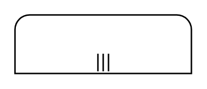

# Participant, Initiating, Multi-Instance, Top

## Definition

```
{
  _style: 'shape=mxgraph.bpmn.task2;part=1;taskMarker=abstract;rectStyle=rounded;bottomRightStyle=square;bottomLeftStyle=square;verticalAlign=top;isLoopMultiParallel=1;whiteSpace=wrap;html=1;',
  _width: 120,
  _height: 40,
}
```

## Usage

```
import { ParticipantInitiatingMultiInstanceTop } from '@reactiac/standard-components-diagrams/bpmn2Choreographies'

<ParticipantInitiatingMultiInstanceTop/>
```

## Preview


