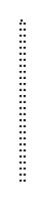

# Participant, Initiating, Top with Decorator 3

## Definition

```
{
  _style: { 
    entity: 'edgeStyle=orthogonalEdgeStyle;html=1;elbow=horizontal;endArrow=none;labelBackgroundColor=none;endSize=12;endFill=0;dashed=1;dashPattern=1 2;exitX=0.5;exitY=0;rounded=0;',
  },
  _original_width: 2,
  _original_height: 80,
}
```

## Usage

```
import { ParticipantInitiatingTopWithDecorator3 } from '@diac/standard-components-diagrams/bpmn2Choreographies'

<ParticipantInitiatingTopWithDecorator3/>
```

## Preview


